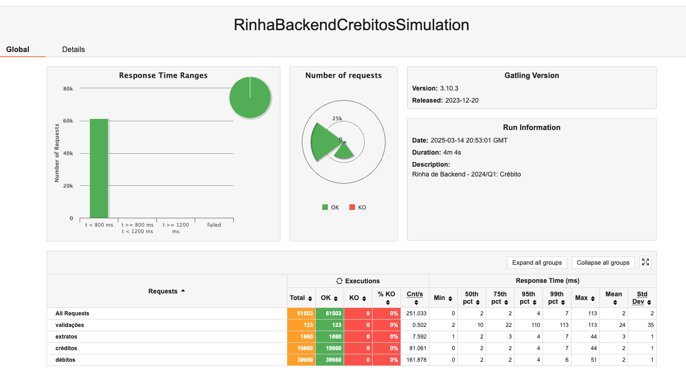
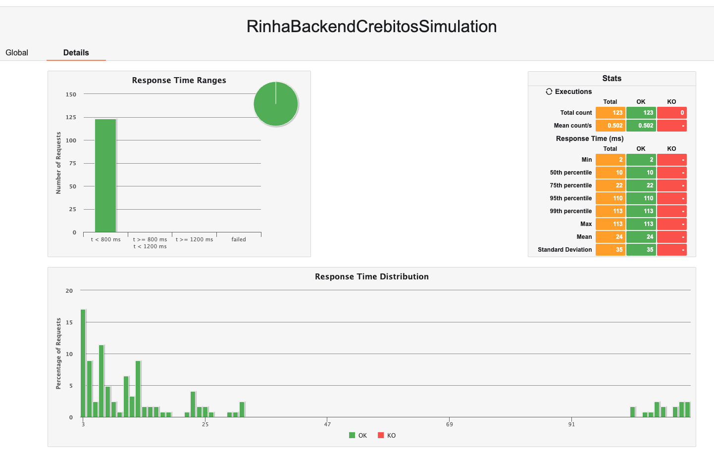
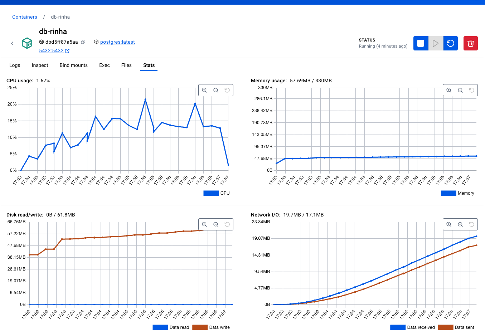
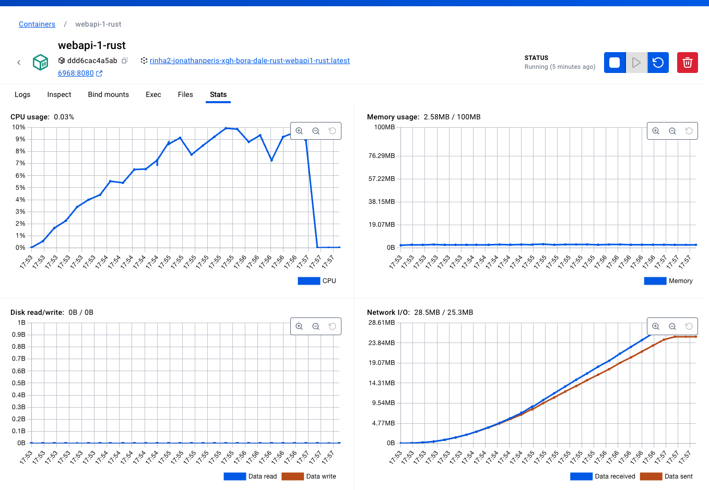
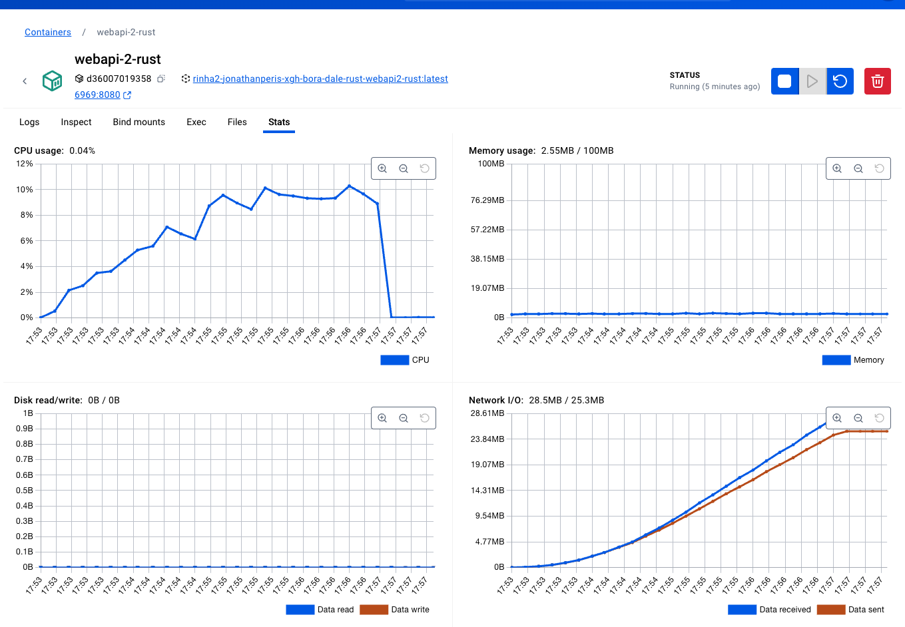
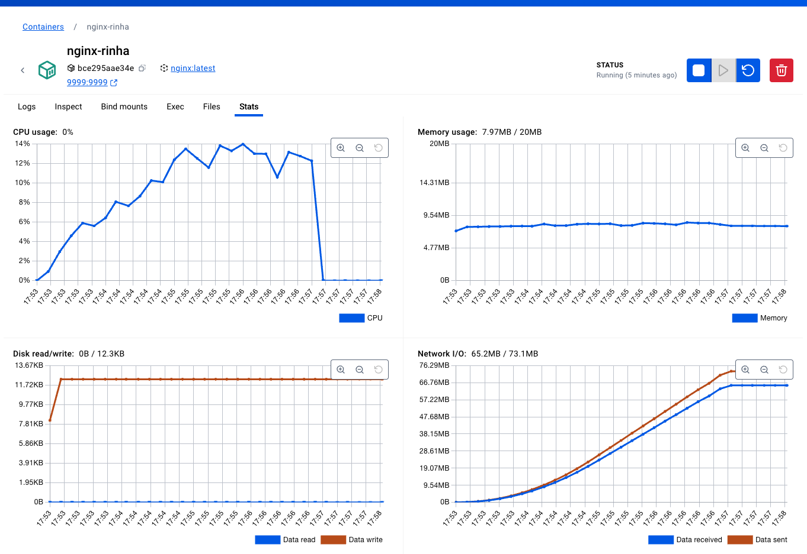

# Rinha de Backend - Segunda Edição

Versão Rust da [rinha de backend 2ª edição - 2024/Q1](https://github.com/zanfranceschi/rinha-de-backend-2024-q1). 

## Stack

- rust
- nginx
- postgresql

## Rodando o projeto

```bash
docker compose up nginx -d --build
```

## Resultados

### Resultado do Gatling local

Todas requisições abaixo de 800ms. (Estes testes utilizaram um máximo de 250MB RAM distribuidos entre os recursos. 60% menos recurso de memória RAM do que o permitido pela rinha!





## Métricas dos testes

Métricas colhidas no Docker Desktop após a execução do teste. O teste foi executado em um Mac Mini M1 16GB RAM/512GB SSD.

- Banco de dados (Postgresql)



- Endpoints (Rust)





- Proxy reverso (Nginx)



## Versões alternativas

### Implementações que elaborei em outras linguagens

- [rinha2-back-end-bora-dale-xgh-dotnet](https://github.com/jonathanperis/rinha2-back-end-bora-dale-xgh-dotnet)
- [rinha2-back-end-bora-dale-xgh-go](https://github.com/jonathanperis/rinha2-back-end-bora-dale-xgh-go)
- [rinha2-back-end-bora-dale-xgh-python](https://github.com/jonathanperis/rinha2-back-end-bora-dale-xgh-python)
- [rinha2-back-end-bora-dale-xgh-postgrest](https://github.com/jonathanperis/rinha2-back-end-bora-dale-xgh-postgrest)